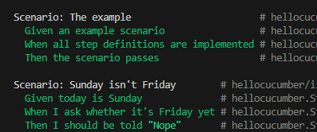
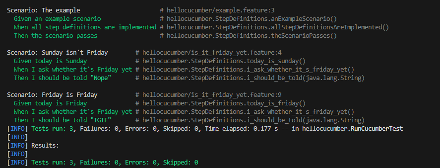
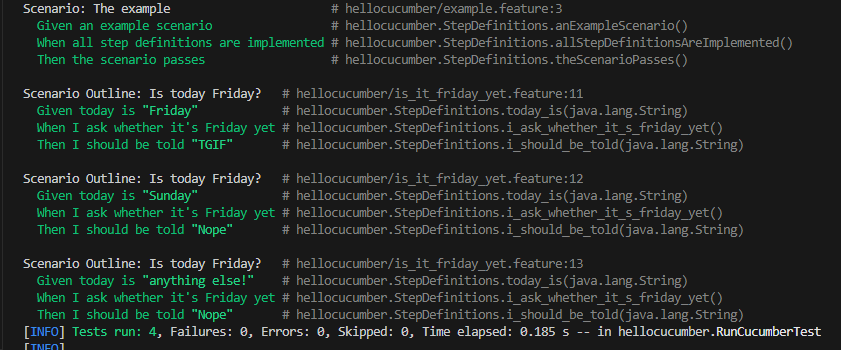

= R5.A.08 -- Dépôt pour les TPs
:icons: font
:MoSCoW: https://fr.wikipedia.org/wiki/M%C3%A9thode_MoSCoW[MoSCoW]

Ce dépôt concerne les rendus de mailto:alexandre.vignal@etu.univ-tlse2.fr[Alexandre Vignal].

== TP1

.it_is_friday_yet.feature :
[source,gherkin]
---
Feature: Is it Friday yet?
  Everybody wants to know when it's Friday

  Scenario Outline: Is today Friday?
    Given today is "<day>"
    When I ask whether it's Friday yet
    Then I should be told "<answer>"

    Examples:
      | day            | answer |
      | Friday         | TGIF   |
      | Sunday         | Nope   |
      | anything else! | Nope   |
---

.Tests effectués :

== TP2...
